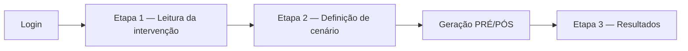

# Sistema de Avaliação de Intervenções Pedagógicas

Aplicação web desenvolvida como **artefato de pesquisa** para a dissertação de mestrado em Informática na Educação (PPGI/UFAL). O sistema apoia professores na **configuração de critérios de sucesso** e na **interpretação da eficácia** de intervenções pedagógicas aplicadas a turmas, com base em indicadores de aprendizagem e de processo.

> **Pergunta operacional:** *A intervenção cadastrada foi eficaz para a aprendizagem, segundo os critérios que o próprio usuário definiu?*

---

## Sumário

- [Contexto e objetivo](#contexto-e-objetivo)
- [Funcionalidades](#funcionalidades)
- [Metodologia de avaliação](#metodologia-de-avaliação)
- [Fluxo de uso](#fluxo-de-uso)
- [Tecnologias](#tecnologias)
- [Estrutura do repositório](#estrutura-do-repositório)
- [Instalação e execução local](#instalação-e-execução-local)
- [Configuração](#configuração)
- [Testes automatizados](#testes-automatizados)
- [Deploy em produção](#deploy-em-produção)
- [Documentação complementar](#documentação-complementar)
- [Licença e uso acadêmico](#licença-e-uso-acadêmico)

---

## Contexto e objetivo

O software implementa um protótipo funcional de **plataforma de avaliação de intervenções pedagógicas**. Nele, o professor:

1. Lê a descrição de uma intervenção pedagógica simulada;
2. Define um **cenário de avaliação** (Flexível ou Difícil) e ajusta **limiares** de aderência, temporalidade e desempenho;
3. Analisa **resultados agregados** por turma, com veredito de eficácia e interpretação pedagógica.

Os dados de alunos utilizados no protótipo são **sintéticos e reprodutíveis** (arquivos JSON por turma e cenário), permitindo demonstração e validação do sistema sem integração com ambientes reais de gestão de aprendizagem.

Este repositório contém **somente o núcleo da aplicação de intervenções**. O módulo de experimento com questionário e painel de pesquisa foi mantido em repositório separado, conforme a delimitação metodológica da dissertação.

---

## Funcionalidades

| Área | Descrição |
|------|-----------|
| **Autenticação** | Login de professor com e-mail e senha |
| **Intervenções** | Listagem e criação de intervenções vinculadas ao usuário e à turma |
| **Wizard em 3 etapas** | Leitura → definição de cenário → resultados |
| **Cenários** | Flexível e Difícil, com limiares padrão sugeridos e ajustáveis |
| **Geração de dados** | Avaliações PRÉ e PÓS sintéticas por aluno ao salvar o cenário |
| **Resultados** | Dashboard com métricas, veredito (Eficaz / Não eficaz / Sem relevância) e interpretação em camadas |
| **Turmas** | Visão das turmas disponíveis e datasets associados |
| **Metodologia** | Download do documento formal de metodologia de eficácia (PDF) |
| **API JSON** | Endpoints autenticados para painéis dinâmicos na tela de resultados |

---

## Metodologia de avaliação

A classificação de eficácia combina:

- **Desempenho (central):** comparação pré → pós por aluno aderente. Sem ganho de desempenho, a intervenção é **não eficaz**, independentemente dos demais indicadores.
- **Processo:** adesão, aderência e temporalidade (início e fim da atividade).
- **Critérios de referência:** limiares definidos pelo usuário na etapa de cenário.

Documentação detalhada:

- [`docs/metodologia-avaliacao-eficacia.md`](docs/metodologia-avaliacao-eficacia.md) — fundamentação e regras
- [`docs/regras-negocio.md`](docs/regras-negocio.md) — regras formais implementadas

### Limiares padrão por cenário

| Cenário | Aderência (≥) | Temp. início (≤) | Temp. fim (≤) | Desempenho (≥) |
|---------|---------------|-------------------|---------------|----------------|
| Flexível | 25% | 20 min | 60 min | 25% |
| Difícil | 80% | 10 min | 30 min | 80% |

---

## Fluxo de uso



1. Acesse `/login` e autentique-se.
2. Em **Intervenções → Nova**, leia a descrição da intervenção pedagógica.
3. Clique em **Definir cenário de avaliação**, escolha Flexível ou Difícil e ajuste os limiares.
4. Ao salvar, o sistema gera os dados sintéticos e redireciona para **Resultados**, onde é possível analisar a eficácia por turma e intervenção.

---

## Tecnologias

| Camada | Tecnologia |
|--------|------------|
| Backend | PHP 8.2+, Laravel 12 |
| Banco de dados | SQLite (protótipo); compatível com MySQL/PostgreSQL |
| Frontend | Blade, Bootstrap 5, CSS customizado |
| Build | Vite 7, Tailwind CSS 4 |
| Testes | PHPUnit 11 |
| Deploy | Docker (Apache + PHP 8.4), Dokploy/Traefik |

---

## Estrutura do repositório

```
app/
  Http/Controllers/     # Intervenções, resultados, turmas, login
  Services/             # Cenário, eficácia, agregação, geração sintética
  Models/               # Intervencao, Avaliacao, Turma, Aluno, User
config/
  intervencao.php       # Textos e conteúdos padrão das intervenções
data/turmas/            # Datasets sintéticos (JSON) — fora do volume do SQLite
database/migrations/    # Schema do banco
docs/                   # Documentação acadêmica e técnica
resources/views/        # Templates Blade
tests/                  # Testes unitários e de integração
```

Arquitetura: **monolito MVC** com **camada de serviços** para regras de negócio. Descrição completa em [`docs/DESENVOLVIMENTO-SISTEMA-AVALIACAO-INTERVENCOES.md`](docs/DESENVOLVIMENTO-SISTEMA-AVALIACAO-INTERVENCOES.md).

---

## Instalação e execução local

### Requisitos

- PHP 8.2+ (`pdo_sqlite`, `mbstring`, `openssl`)
- [Composer](https://getcomposer.org)
- Node.js 18+ (opcional; para compilar assets front-end)

### Passo a passo

```bash
git clone <url-do-repositorio>
cd avaliacao-intervencoes

composer install
cp .env.example .env
php artisan key:generate
touch database/database.sqlite
php artisan migrate:fresh --seed

# Opcional: compilar assets
npm install && npm run build

php artisan serve --port=8001
```

Acesse **http://127.0.0.1:8001/login**

**Credenciais de demonstração** (após `migrate:fresh --seed`):

| Campo | Valor |
|-------|-------|
| E-mail | `professor@example.com` |
| Senha | `password` |

> Se a porta 8000 já estiver em uso por outro projeto, use outra porta (`--port=8001`) ou encerre o processo anterior.

Atalho com script Composer:

```bash
composer run setup
php artisan migrate:fresh --seed
php artisan serve
```

---

## Configuração

Principais variáveis em `.env`:

| Variável | Descrição | Padrão |
|----------|-----------|--------|
| `APP_URL` | URL base da aplicação | `http://127.0.0.1:8000` |
| `DB_CONNECTION` | Driver do banco | `sqlite` |
| `RESULTADOS_CACHE_TTL` | TTL do cache de agregações (s) | `3600` |
| `RESULTADOS_QUEUE_GENERATION` | Geração assíncrona via fila | `false` |
| `INTERVENCAO_TURMA_PADRAO` | Turma usada ao criar intervenção | `2º Ano A` |
| `INTERVENCAO_APP_TITULO` | Título exibido no login | (ver `config/intervencao.php`) |

Conteúdos das intervenções por cenário podem ser ajustados em `config/intervencao.php` ou via seed (`EstudoConfiguracaoSeeder`).

---

## Testes automatizados

```bash
composer run test
# ou
php artisan test
```

A suíte cobre regras de cenário, geração sintética, fluxo de intervenção, login, API de resultados e integridade do schema SQLite.

---

## Deploy em produção

```bash
docker compose -f docker-compose.prod.yml up --build
```

Orientações detalhadas:

- [`docs/DEPLOY-VPS-PAINEL.md`](docs/DEPLOY-VPS-PAINEL.md) — VPS com Dokploy
- [`docs/DOKPLOY-BANCO-PERSISTENTE.md`](docs/DOKPLOY-BANCO-PERSISTENTE.md) — volume persistente do SQLite
- [`docs/deploy.md`](docs/deploy.md) — notas gerais de deploy

**Importante:** monte o volume persistente apenas em `database/` (SQLite). Os datasets em `data/turmas/` devem permanecer na imagem do container.

---

## Documentação complementar

| Documento | Conteúdo |
|-----------|----------|
| [`docs/DESENVOLVIMENTO-SISTEMA-AVALIACAO-INTERVENCOES.md`](docs/DESENVOLVIMENTO-SISTEMA-AVALIACAO-INTERVENCOES.md) | Desenvolvimento do sistema (requisitos, arquitetura, fluxos) |
| [`docs/metodologia-avaliacao-eficacia.md`](docs/metodologia-avaliacao-eficacia.md) | Metodologia de eficácia |
| [`docs/regras-negocio.md`](docs/regras-negocio.md) | Regras de negócio |
| [`docs/PLANO-IMPLEMENTACAO.md`](docs/PLANO-IMPLEMENTACAO.md) | Plano de implementação por fases |
| [`docs/ui.md`](docs/ui.md) | Guia de interface |
| [`docs/GIT-GITHUB.md`](docs/GIT-GITHUB.md) | Publicação no GitHub |

---

## Licença e uso acadêmico

O framework Laravel é distribuído sob licença [MIT](https://opensource.org/licenses/MIT).

O código e a documentação deste repositório foram produzidos no âmbito de pesquisa acadêmica. Recomenda-se citar a dissertação correspondente ao utilizar ou referenciar este artefato em trabalhos derivados.

**Autora:** Dalmaris de Lima Moraes — PPGI/UFRN
