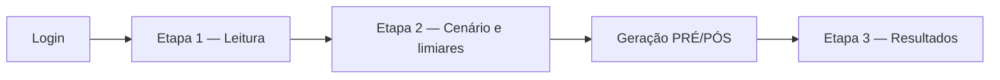

# Sistema de Avaliação de Intervenções Pedagógicas

Aplicação web para **avaliação de intervenções pedagógicas** em turmas. O professor configura critérios de sucesso (limiares de aderência, temporalidade e desempenho), registra intervenções por turma e analisa se a ação foi **eficaz para a aprendizagem**, com base em indicadores de processo e em comparação pré/pós.

> **Pergunta que o sistema responde:** *A intervenção foi eficaz para a aprendizagem, segundo os critérios que o próprio usuário definiu?*

---

## Sumário

- [Objetivo](#objetivo)
- [Funcionalidades](#funcionalidades)
- [Metodologia de avaliação](#metodologia-de-avaliação)
- [Fluxo de uso](#fluxo-de-uso)
- [Tecnologias](#tecnologias)
- [Estrutura do repositório](#estrutura-do-repositório)
- [Instalação e execução local](#instalação-e-execução-local)
- [Configuração](#configuração)
- [Testes automatizados](#testes-automatizados)
- [Deploy em produção](#deploy-em-produção)
- [Documentação complementar](#documentação-complementar)
- [Licença](#licença)

---

## Objetivo

A plataforma apoia o ciclo de avaliação de uma intervenção pedagógica em três momentos:

1. **Leitura** — descrição da intervenção aplicada à turma;
2. **Configuração** — escolha do cenário (Flexível ou Difícil) e definição dos limiares de avaliação;
3. **Análise** — visualização de resultados, veredito de eficácia e interpretação pedagógica.

Os dados de alunos são **sintéticos** (arquivos JSON por turma e cenário em `data/turmas/`), o que permite usar e testar a ferramenta de forma reprodutível, sem depender de um sistema externo de gestão de aprendizagem.

---

## Funcionalidades

| Módulo | Descrição |
|--------|-----------|
| **Autenticação** | Acesso com e-mail e senha |
| **Intervenções** | Listagem e criação de intervenções por usuário e turma |
| **Wizard (3 etapas)** | Leitura → cenário → resultados |
| **Cenários** | Flexível e Difícil, com limiares padrão editáveis |
| **Avaliações sintéticas** | Geração automática de dados PRÉ e PÓS por aluno ao salvar o cenário |
| **Resultados** | Métricas agregadas, veredito (Eficaz / Não eficaz / Sem relevância) e interpretação em camadas |
| **Turmas** | Consulta às turmas disponíveis e respectivos datasets |
| **Metodologia** | Download do documento de metodologia de eficácia |
| **API JSON** | Endpoints autenticados para gráficos e painéis na tela de resultados |

---

## Metodologia de avaliação

A eficácia é calculada a partir de:

- **Desempenho (indicador central):** ganho de desempenho pré → pós por aluno aderente. Sem ganho, a intervenção é classificada como **não eficaz**, independentemente dos demais indicadores.
- **Processo:** adesão, aderência e temporalidade (início e fim da atividade).
- **Limiares:** valores mínimos ou máximos definidos pelo usuário na etapa de cenário.

Detalhes em [`docs/metodologia-avaliacao-eficacia.md`](docs/metodologia-avaliacao-eficacia.md) e [`docs/regras-negocio.md`](docs/regras-negocio.md).

### Limiares padrão sugeridos

| Cenário | Aderência (≥) | Temp. início (≤) | Temp. fim (≤) | Desempenho (≥) |
|---------|---------------|-------------------|---------------|----------------|
| Flexível | 25% | 20 min | 60 min | 25% |
| Difícil | 80% | 10 min | 30 min | 80% |

---

## Fluxo de uso



1. Acesse `/login` e entre com suas credenciais.
2. Em **Intervenções → Nova**, leia a descrição da intervenção.
3. Clique em **Definir cenário de avaliação**, selecione Flexível ou Difícil e ajuste os limiares.
4. Ao salvar, o sistema gera os dados e abre **Resultados** com a análise por turma e intervenção.

---

## Tecnologias

| Camada | Tecnologia |
|--------|------------|
| Backend | PHP 8.2+, Laravel 12 |
| Banco de dados | SQLite; compatível com MySQL/PostgreSQL |
| Interface | Blade, Bootstrap 5, CSS customizado |
| Build front-end | Vite 7, Tailwind CSS 4 |
| Testes | PHPUnit 11 |
| Produção | Docker (Apache + PHP 8.4) |

---

## Estrutura do repositório

```
app/
  Http/Controllers/     # Intervenções, resultados, turmas, autenticação
  Services/             # Cenário, eficácia, agregação, geração sintética
  Models/               # Intervencao, Avaliacao, Turma, Aluno, User
config/
  intervencao.php       # Textos e conteúdos das intervenções por cenário
data/turmas/            # Datasets sintéticos (JSON)
database/migrations/    # Schema do banco
docs/                   # Metodologia, regras de negócio e guias técnicos
resources/views/        # Telas do wizard e dashboards
tests/                  # Testes automatizados
```

Arquitetura **MVC** com camada de **serviços de domínio**. Documentação técnica completa: [`docs/DESENVOLVIMENTO-SISTEMA-AVALIACAO-INTERVENCOES.md`](docs/DESENVOLVIMENTO-SISTEMA-AVALIACAO-INTERVENCOES.md).

---

## Instalação e execução local

### Requisitos

- PHP 8.2+ (`pdo_sqlite`, `mbstring`, `openssl`)
- [Composer](https://getcomposer.org)
- Node.js 18+ (opcional, para compilar assets)

### Passo a passo

```bash
git clone https://github.com/DalmarisLima/avaliacao-intervencoes.git
cd avaliacao-intervencoes

composer install
cp .env.example .env
php artisan key:generate
touch database/database.sqlite
php artisan migrate:fresh --seed

npm install && npm run build   # opcional

php artisan serve
```

Acesse **http://127.0.0.1:8000/login**

| Campo | Valor (após seed) |
|-------|-------------------|
| E-mail | `professor@example.com` |
| Senha | `password` |

Atalho:

```bash
composer run setup
php artisan migrate:fresh --seed
php artisan serve
```

---

## Configuração

| Variável | Descrição | Padrão |
|----------|-----------|--------|
| `APP_URL` | URL base | `http://127.0.0.1:8000` |
| `DB_CONNECTION` | Banco de dados | `sqlite` |
| `RESULTADOS_CACHE_TTL` | Cache de agregações (segundos) | `3600` |
| `RESULTADOS_QUEUE_GENERATION` | Geração em fila | `false` |
| `INTERVENCAO_TURMA_PADRAO` | Turma ao criar intervenção | `2º Ano A` |
| `INTERVENCAO_APP_TITULO` | Título na tela de login | ver `config/intervencao.php` |

Textos das intervenções por cenário: `config/intervencao.php` ou `database/seeders/EstudoConfiguracaoSeeder.php`.

---

## Testes automatizados

```bash
composer run test
```

Cobertura: regras de cenário, geração sintética, fluxo completo de intervenção, autenticação, API de resultados e schema do banco.

---

## Deploy em produção

```bash
docker compose -f docker-compose.prod.yml up --build
```

Guias:

- [`docs/DEPLOY-VPS-PAINEL.md`](docs/DEPLOY-VPS-PAINEL.md)
- [`docs/DOKPLOY-BANCO-PERSISTENTE.md`](docs/DOKPLOY-BANCO-PERSISTENTE.md)
- [`docs/deploy.md`](docs/deploy.md)

Persistir apenas `database/` (SQLite). Manter `data/turmas/` na imagem do container.

---

## Documentação complementar

| Documento | Conteúdo |
|-----------|----------|
| [`docs/DESENVOLVIMENTO-SISTEMA-AVALIACAO-INTERVENCOES.md`](docs/DESENVOLVIMENTO-SISTEMA-AVALIACAO-INTERVENCOES.md) | Requisitos, arquitetura e fluxos |
| [`docs/metodologia-avaliacao-eficacia.md`](docs/metodologia-avaliacao-eficacia.md) | Metodologia de eficácia |
| [`docs/regras-negocio.md`](docs/regras-negocio.md) | Regras de negócio |
| [`docs/ui.md`](docs/ui.md) | Interface e componentes visuais |

---

## Licença

Laravel — [MIT](https://opensource.org/licenses/MIT).

**Autora:** Dalmaris de Lima Moraes — PPGI/UFAL
