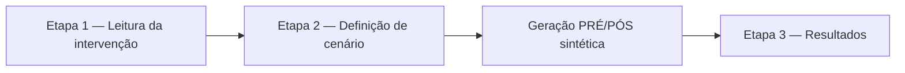
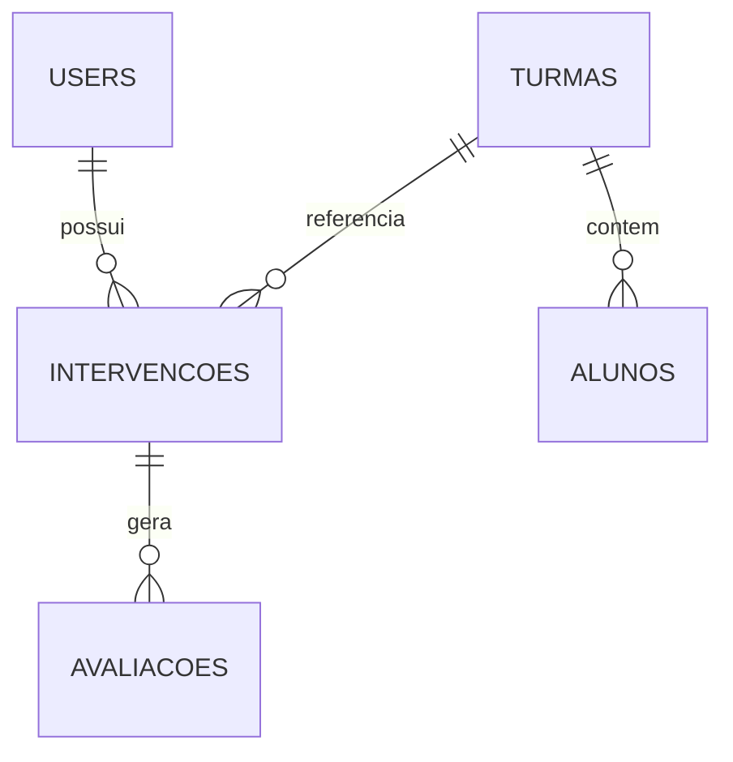
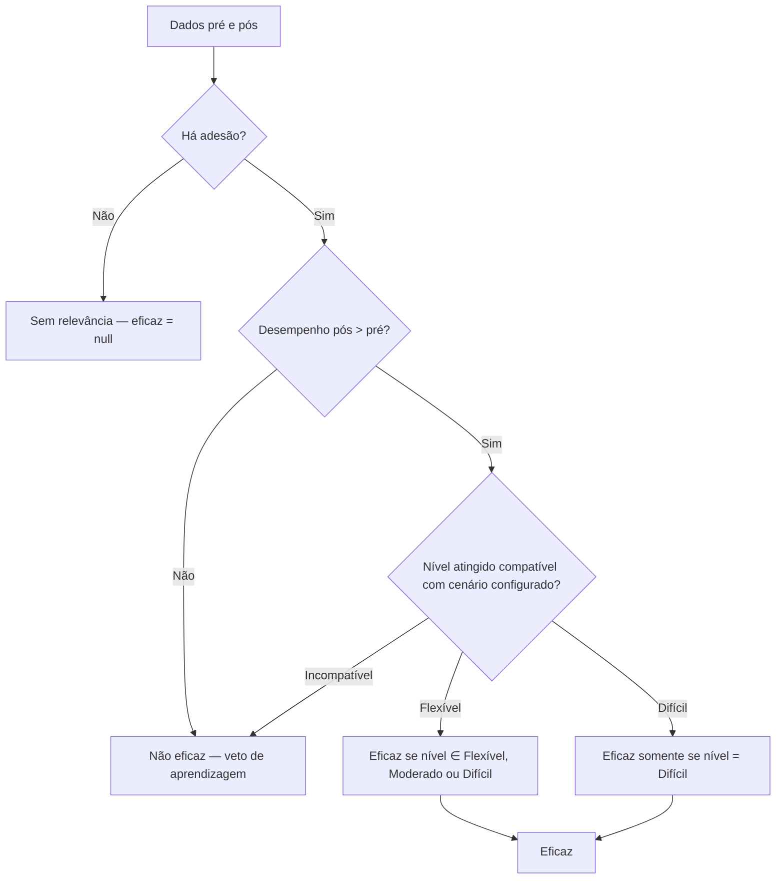

# Desenvolvimento do sistema de avaliação de intervenções pedagógicas

**Projeto:** Intervenções App  
**Versão do documento:** 1.0 (julho/2026)  
**Escopo:** desenvolvimento do **sistema de avaliação de intervenções** — sem descrição do módulo de questionário, fluxo experimental ou painel de pesquisa.  
**Referência cruzada:** metodologia de eficácia em `docs/metodologia-avaliacao-eficacia.md` e regras formais em `docs/regras-negocio.md`.

---

## 1. Introdução e objetivo do software

O sistema de avaliação de intervenções pedagógicas é uma aplicação web que apoia o professor (ou participante em condição de uso do protótipo) na **configuração de critérios de sucesso** e na **interpretação da eficácia** de ações pedagógicas aplicadas a uma turma.

A pergunta operacional que o software responde é:

> *A intervenção cadastrada foi eficaz para a aprendizagem, segundo os critérios que o próprio usuário definiu?*

Para isso, o sistema combina:

1. **Evidência de aprendizagem** — comparação de desempenho pré e pós-intervenção por aluno;
2. **Indicadores de processo** — adesão, aderência e temporalidade (início e fim da atividade);
3. **Critérios de referência** — limiares mínimos (ou máximos, no caso do tempo) configurados na etapa de definição de cenário.

O **desempenho** é tratado como indicador **central e condicionante**: na ausência de ganho pré→pós, a intervenção é classificada como **não eficaz**, independentemente de bons valores nas demais métricas.

No protótipo atual, os dados de alunos são **sintéticos e fixos** (arquivos JSON por turma), permitindo reprodutibilidade do experimento sem integração com sistemas reais de gestão de aprendizagem.

### 1.1 Integração com o experimento (escopo de uso)

No estudo com participantes, **apenas duas superfícies funcionais** do sistema de intervenções foram expostas na interface do experimento:

| Superfície | Rota / tela | Função |
|------------|-------------|--------|
| **Definição de cenário** | `GET /intervencoes/{id}/cenario` | Escolha entre cenário **Flexível** ou **Difícil** e ajuste dos limiares |
| **Resultados** | `GET /resultados?turma=…` | Análise pré/pós, veredito de eficácia e detalhamento por intervenção |

O fluxo completo do sistema inclui também a **leitura da intervenção** (Etapa 1) e a **listagem de intervenções**, mas no experimento o participante é conduzido diretamente a essas duas telas por meio de perguntas do tipo *tela do sistema* no questionário. O retorno ao questionário ocorre após salvar cada cenário.

---

## 2. Requisitos do sistema

### 2.1 Requisitos funcionais

| ID | Requisito |
|----|-----------|
| RF01 | Permitir ao usuário autenticado criar e listar intervenções pedagógicas vinculadas a uma turma |
| RF02 | Exibir descrição da intervenção antes da configuração de cenário (Etapa 1 do wizard) |
| RF03 | Permitir seleção de cenário **Flexível** ou **Difícil** e ajuste de quatro limiares: aderência, temporalidade de início, temporalidade de fim e desempenho |
| RF04 | Gerar automaticamente avaliações **PRÉ** e **PÓS** para cada aluno do dataset da turma ao salvar o cenário |
| RF05 | Impedir nova geração ou avaliação manual após `dados_gerados_at` preenchido |
| RF06 | Agregar métricas por turma e por intervenção, considerando apenas alunos aderentes no pós |
| RF07 | Classificar cada intervenção como **Eficaz**, **Não eficaz** ou **Sem relevância** |
| RF08 | Apresentar interpretação pedagógica em três camadas (aprendizagem, processo, meta do professor) |
| RF09 | Isolar dados por usuário (`user_id`); cada professor vê somente suas intervenções |
| RF10 | Disponibilizar API JSON autenticada para painéis dinâmicos na tela de resultados |
| RF11 | Permitir download da documentação da metodologia de eficácia (PDF) |

### 2.2 Requisitos não funcionais

| ID | Requisito |
|----|-----------|
| RNF01 | Interface responsiva com Bootstrap 5 e fluxo guiado em três etapas (wizard) |
| RNF02 | Cache de agregações de resultados com TTL configurável (`RESULTADOS_CACHE_TTL`, padrão 3600 s) |
| RNF03 | Geração síncrona de dados por padrão; opção assíncrona via fila (`RESULTADOS_QUEUE_GENERATION`) |
| RNF04 | Implantação em container Docker com volume persistente para o banco SQLite |
| RNF05 | Cobertura de regras críticas por testes automatizados (PHPUnit) |

---

## 3. Arquitetura e tecnologias

### 3.1 Stack tecnológico

| Camada | Tecnologia |
|--------|------------|
| Linguagem / framework | PHP 8.2+, Laravel 12 |
| Banco de dados | SQLite (protótipo); suporte documentado a MySQL/PostgreSQL |
| Templates | Blade |
| Estilos | Bootstrap 5, CSS customizado (`public/css/ui.css`, `charts.css`) |
| Build de assets | Vite 7, Tailwind CSS 4 |
| Geração de PDF | DomPDF (`barryvdh/laravel-dompdf`) — documentação da metodologia |
| Servidor de produção | PHP 8.4 + Apache (imagem `Dockerfile.prod`) |
| Proxy / HTTPS | Traefik + Let's Encrypt (Dokploy) |

### 3.2 Padrão arquitetural

Aplicação **monolítica MVC** com **camada de serviços** para regras de negócio:

```
Controllers
  IntervencaoController    → cadastro, cenário, geração de dados
  ResultadosController     → dashboard e API de resultados
  AvaliacaoController      → avaliação manual (pré-geração)
  TurmaController          → visão por turmas

Services (domínio)
  CenarioService                    → normalização, perfis, classificação, eficácia
  EficaciaInterpretacaoService      → interpretação em 3 camadas + índice 0–100
  ResultadosAggregatorService       → agregação e cache
  TurmaProgressoMetricasService     → médias pré/pós entre aderentes
  SyntheticEvaluationGenerator      → geração PRÉ/PÓS
  SyntheticDatasetRepository        → leitura de datasets JSON
  IntervencaoProfessorInsightsService → textos e recomendações por intervenção

Models
  Intervencao, Avaliacao, Turma, Aluno

Dados externos
  data/turmas/*.json                → perfis sintéticos por turma e cenário
```

### 3.3 Fluxo principal do usuário (wizard)



| Etapa | Rota | View |
|-------|------|------|
| 1 | `GET /intervencoes/nova` | `intervencoes/create.blade.php` |
| 2 | `GET /intervencoes/{id}/cenario` | `intervencoes/definir-cenario.blade.php` |
| 3 | `GET /resultados` | `intervencoes/resultados.blade.php` |

Componente visual: `<x-wizard-steps>` indica a etapa atual (1, 2 ou 3).

---

## 4. Modelagem de dados

### 4.1 Entidade `intervencoes`

Representa uma ação pedagógica cadastrada pelo usuário.

| Campo | Tipo | Descrição |
|-------|------|-----------|
| `id` | PK | Identificador |
| `user_id` | FK | Proprietário (isolamento de dados) |
| `titulo` | string | Nome da intervenção |
| `tipo_atividade` | string | Ex.: Presencial, Online |
| `descricao` | text | Resumo textual |
| `turma_id` | FK opcional | Referência à tabela `turmas` |
| `turma` | string | Nome da turma (ex.: `2º Ano A`) |
| `cenario` | string | `flexivel` ou `dificil` (após configuração) |
| `limiar_aderencia` | int | % mínimo de aderência entre aderentes |
| `limiar_temporalidade_inicio` | int | Minutos máximos para iniciar |
| `limiar_temporalidade_fim` | int | Minutos máximos para concluir |
| `limiar_desempenho` | int | % mínimo de desempenho no pós |
| `dados_gerados_at` | timestamp | Trava pós-geração sintética |
| `data_inicio`, `data_fim` | date | Período da intervenção |
| `link` | string opcional | URL complementar |

**Status derivado** (acessor no model): *Novo*, *Em andamento* ou *Finalizado*, conforme datas.

### 4.2 Entidade `avaliacoes`

Uma linha por aluno × tipo (pré ou pós) × intervenção.

| Campo | Tipo | Descrição |
|-------|------|-----------|
| `intervencao_id` | FK | Intervenção vinculada |
| `tipo` | enum string | `pre` ou `pos` |
| `aluno_numero` | int | Número do aluno no dataset |
| `aluno_nome` | string | Nome do aluno |
| `cenario` | string | Cenário no momento da avaliação |
| `adesao` | int (0/1) | Participou? (relevante no pós) |
| `aderencia` | int | % de execução das tarefas |
| `temporalidade_inicio` | int | Minutos até iniciar |
| `temporalidade_fim` | int | Minutos até concluir |
| `temporalidade` | int | Média aritmética início/fim |
| `desempenho` | int | % de aprendizagem |
| `observacoes` | text | Notas do dataset |

**Integridade:** índice único `(intervencao_id, aluno_numero, tipo)`.

### 4.3 Turmas e alunos

- Catálogo fixo em `config/turmas.php`: 1º Ano A, 1º Ano B, 2º Ano A, 3º Ano A, Turma Reforço.
- Tabelas `turmas` e `alunos` existem para seed administrativo; os valores de avaliação vêm dos **datasets JSON**, não de entrada manual em tempo de execução.

### 4.4 Diagrama entidade-relacionamento (simplificado)



---

## 5. Cenários e limiares

### 5.1 Cenários disponíveis na interface

O enum `App\Enums\Cenario` define três perfis internos (`flexivel`, `moderado`, `dificil`), mas a **configuração na Etapa 2** expõe apenas:

| Cenário | Valor interno | Limiares padrão sugeridos |
|---------|---------------|---------------------------|
| **Flexível** | `flexivel` | Aderência 25%, início ≤ 20 min, fim ≤ 60 min, desempenho ≥ 25% |
| **Difícil** | `dificil` | Aderência 80%, início ≤ 10 min, fim ≤ 30 min, desempenho ≥ 80% |

O cenário **Moderado** permanece na lógica de classificação de resultado, mas não é oferecido no formulário atual. Registros legados com `moderado` são normalizados na exibição.

### 5.2 Comportamento dos limiares

- Os limiares são **critérios de referência** definidos pelo usuário;
- **Não alteram** os valores numéricos gravados nas avaliações;
- Influenciam apenas a **interpretação** e o veredito de eficácia.

Textos de ajuda contextual estão em `config/metricas_cenario.php` e são exibidos na tela de definição de cenário (`metricas-cenario-ajuda.blade.php`).

---

## 6. Metodologia de avaliação de eficácia (implementação)

A lógica está distribuída em `CenarioService` (decisão binária eficaz/não eficaz) e `EficaciaInterpretacaoService` (textos e índice sintético).

### 6.1 Métricas e agregação

| Métrica | Significado | Regra de agregação |
|---------|-------------|-------------------|
| **Adesão** | Aluno participou da intervenção | % de alunos com `adesao = 1` no pós |
| **Aderência** | Execução da proposta pedagógica | Média **somente entre aderentes** |
| **Temporalidade início** | Minutos até iniciar (menor = melhor) | Média entre aderentes; comparada ao limiar máximo |
| **Temporalidade fim** | Minutos até concluir (menor = melhor) | Idem |
| **Desempenho** | Resultado de aprendizagem (%) | Média entre aderentes; comparado ao pré |

O serviço `TurmaProgressoMetricasService` garante que médias **pré** sejam calculadas sobre o **mesmo subconjunto** de alunos aderentes no pós, evitando distorção na comparação.

### 6.2 Classificação do nível atingido (`classificarResultado`)

Ordem de avaliação (do mais rigoroso ao configurável):

1. **Sem participação** — adesão percentual ≤ 0  
2. **Difícil** — aderência ≥ 80, temp. início ≤ 10, temp. fim ≤ 30, desempenho ≥ 80  
3. **Moderado** — aderência ≥ 60, temp. início ≤ 15, temp. fim ≤ 45, desempenho ≥ 60  
4. **Flexível** — atende aos limiares configurados na intervenção  
5. **Abaixo dos critérios** — caso contrário  

### 6.3 Decisão de eficácia (`avaliarEficacia`)



| Cenário configurado | Eficaz quando o nível observado for |
|---------------------|-------------------------------------|
| Flexível | Flexível, Moderado ou Difícil |
| Moderado | Moderado ou Difícil |
| Difícil | Apenas Difícil |

### 6.4 Três camadas de interpretação

| Camada | Conteúdo | Pergunta respondida |
|--------|----------|---------------------|
| 1 — Aprendizagem | Comparação pré × pós | Houve ganho de desempenho? |
| 2 — Processo | Adesão, aderência, temporalidades | Participaram e executaram como esperado? |
| 3 — Meta do professor | Cenário e limiares | O resultado atingiu o padrão definido? |

### 6.5 Índice sintético de eficácia (0–100)

Calculado em `EficaciaInterpretacaoService::calcularIndiceEficacia` com pesos aproximados:

- ~50% ganho de desempenho;
- ~10% adesão;
- ~15% aderência;
- ~15% temporalidade;
- ~10% desempenho pós vs limiar.

**Regra:** se não houver ganho de desempenho, o índice é **zero**. O índice é complementar; a classificação oficial permanece Eficaz / Não eficaz / Sem relevância.

### 6.6 Síntese por turma

A turma é considerada com **eficácia plena** quando há ganho médio de desempenho **e** todas as intervenções avaliáveis são individualmente eficazes.

---

## 7. Geração de dados sintéticos

### 7.1 Motivação

O protótipo utiliza dados sintéticos para:

- Reproduzir perfis pedagógicos distintos por turma;
- Permitir comparação entre cenários **Flexível** e **Difícil** com datasets distintos (ex.: turma 2º Ano A);
- Isolar a avaliação da **interface e da metodologia** da coleta de dados reais.

### 7.2 Localização dos datasets

Arquivos em `data/turmas/` (fora do volume do banco SQLite em produção):

| Arquivo | Uso |
|---------|-----|
| `{slug}.json` | Dataset padrão da turma (ex.: `2-ano-a.json`) |
| `{slug}-{cenario}.json` | Dataset por cenário (ex.: `2-ano-a-flexivel.json`, `2-ano-a-dificil.json`) |

Resolução de slug: `SyntheticDatasetRepository` mapeia nomes como `2º Ano A` → `2-ano-a`. Se o arquivo por cenário não existir, usa o dataset padrão ou fallback PHP em `TurmaDatasetDefinitions`.

### 7.3 Perfis documentados por turma

| Turma | Arquivo | Perfil resumido |
|-------|---------|-----------------|
| 1º Ano A | `1-ano-a.json` | Progressão mista |
| 1º Ano B | `1-ano-b.json` | Baixo ganho; tende a não ser eficaz |
| 2º Ano A (flexível) | `2-ano-a-flexivel.json` | 20 alunos; ~12 aderentes; ~68% desempenho pós |
| 2º Ano A (difícil) | `2-ano-a-dificil.json` | 20 alunos; ~18 aderentes; ~42% desempenho pós |
| 3º Ano A | `3-ano-a.json` | Regressão de desempenho |
| Turma Reforço | `reforco.json` | Ganho modesto |

> **Nota para o experimento:** a turma padrão configurada é `2º Ano A` (`config/experimento.php` → `turma_padrao`). Cada participante configura cenário Flexível e Difícil em sequência; os datasets distintos garantem **métricas diferentes** entre os dois cenários, enquanto os limiares padrão de cada perfil influenciam o veredito de eficácia.

### 7.4 Processo de geração (`SyntheticEvaluationGenerator`)

1. Disparado ao salvar cenário (`POST /intervencoes/{id}/cenario`);
2. Verifica `jaGerado()` — rejeita se `dados_gerados_at` ou avaliações pós já existem;
3. Carrega dataset via `SyntheticDatasetRepository::forTurma($turma, $cenario)`;
4. Em transação, para cada aluno do JSON:
   - Cria registro `tipo = pre` (adesão = 0; métricas de linha de base);
   - Cria registro `tipo = pos` (adesão e métricas pós conforme dataset);
5. Atualiza `intervencao.dados_gerados_at = now()`;
6. Invalida cache do usuário (`ResultadosCache::forgetUser`).

**Regeneração em produção** (sem apagar questionário):

```bash
php artisan intervencoes:regenerar-dados-sinteticos --turma="2º Ano A" --force
```

### 7.5 Modo alternativo: avaliação manual

Antes da geração automática, é possível registrar uma avaliação pós agregada manual (`AvaliacaoController`). Após `dados_gerados_at`, essa via é bloqueada.

---

## 8. Agregação de resultados e cache

### 8.1 `ResultadosAggregatorService`

| Método | Retorno |
|--------|---------|
| `dashboard($userId)` | Estatísticas por turma, lista de intervenções, tabela de progressão |
| `turmaStats($userId, $turma, $intervencaoId?)` | Médias pré, pós e ganhos |
| `alunosPorTurma($userId, $turma)` | Matriz aluno × intervenção × pré/pós |
| `intervencoesPorTurma($userId, $turma)` | Agregados por intervenção + `avaliacao_eficacia` |
| `interpretacaoTurma(...)` | Interpretação pedagógica da turma |
| `analiseIntervencao(...)` | Análise detalhada de uma intervenção |

Todas as consultas filtram `intervencoes.user_id = $userId`.

### 8.2 Cache

- TTL: `config('resultados.cache_ttl')` (padrão 3600 s);
- Chaves: `resultados.index.{userId}`, `resultados.v2.{suffix}.{userId}.{hashTurma}`;
- Invalidação: ao gerar, limpar ou regenerar dados sintéticos.

### 8.3 API JSON (sessão autenticada)

| Endpoint | Dados |
|----------|-------|
| `GET /api/turma/{turma}` | Stats + interpretação |
| `GET /api/turma/{turma}/alunos` | Lista de alunos |
| `GET /api/turma/{turma}/intervencoes` | Intervenções agregadas |
| `GET /api/turma/{turma}/interpretacao` | Texto de interpretação |
| `GET /api/turma/{turma}/intervencao/{id}/analise` | Análise de uma intervenção |

A tela de resultados consome esses endpoints via JavaScript para gráficos e painéis dinâmicos.

---

## 9. Interface do usuário

### 9.1 Etapa 1 — Leitura da intervenção

**Rota:** `GET /intervencoes/nova`  
**View:** `resources/views/intervencoes/create.blade.php`

- Exibe conteúdo rich-text da intervenção (configurado pelo pesquisador por cenário em `estudo_configuracao.conteudos_intervencao`);
- Badge com cenário alvo (Flexível ou Difícil) quando o fluxo experimental define `experimento_cenario_alvo` na sessão;
- Botão **Definir cenário de avaliação** → `POST /intervencoes/iniciar-cenario` cria intervenção e redireciona à Etapa 2.

No experimento, esta etapa funciona como **ponte** antes da definição de cenário; o conteúdo exibido corresponde ao cenário que o participante está configurando.

### 9.2 Etapa 2 — Definição de cenário *(incluída no experimento)*

**Rota:** `GET /intervencoes/{id}/cenario`  
**View:** `resources/views/intervencoes/definir-cenario.blade.php`

Elementos da interface:

- Radio buttons: **Flexível** ou **Difícil** (`Cenario::paraConfiguracao()`);
- Sliders (0–100 ou minutos) para os quatro limiares;
- Bloco de ajuda sobre temporalidade (`config/metricas_cenario.php`);
- Resumo da intervenção (título, turma);
- Indicador wizard Etapa 2 de 3.

Ao submeter (`POST /intervencoes/{id}/cenario`):

1. Valida cenário e limiares (`SalvarCenarioRequest`);
2. Atualiza registro da intervenção;
3. Executa `SyntheticEvaluationGenerator::gerar()` (ou enfileira job se configurado);
4. Redireciona — no experimento, de volta ao questionário; no uso direto, à tela de resultados.

### 9.3 Etapa 3 — Resultados *(incluída no experimento)*

**Rota:** `GET /resultados?turma={nome}`  
**View:** `resources/views/intervencoes/resultados.blade.php`

Seções principais:

| Seção | Conteúdo |
|-------|----------|
| Filtros | Turma e intervenção específica |
| Comparação pré/pós | Gráficos de desempenho, aderência, temporalidade |
| Painel de eficácia | Veredito geral (Eficaz / Não eficaz / Sem relevância) |
| Interpretação | Texto automático nas três camadas |
| Por intervenção | Tabela com métricas, checklist de critérios, link de detalhe |
| Por aluno | Comparativo aluno a aluno (quando turma selecionada) |
| Metodologia | Link para download do PDF (`/docs/metodologia-eficacia`) |

Estilos dedicados em `public/css/charts.css`. Componentes de empty state quando não há dados.

### 9.4 Telas complementares (fora do experimento)

| Tela | Rota | Função |
|------|------|--------|
| Listagem de intervenções | `GET /intervencoes` | Tabela com status, turma, cenário |
| Turmas | `GET /turmas` | Visão agregada por classe |
| Avaliação manual | `GET /intervencoes/{id}/avaliacao` | Entrada manual pré-geração |

---

## 10. Segurança e controle de acesso

| Mecanismo | Implementação |
|-----------|---------------|
| Autenticação | Sessão web; login por e-mail (`/acesso`) |
| Middleware `ferramenta` | Garante acesso às rotas de intervenção/resultados |
| `IntervencaoPolicy` | `view`, `update`, `delete` restritos ao `user_id` proprietário |
| Isolamento de dados | Todas as queries de resultados filtram por `user_id` autenticado |
| API | Mesma sessão (`middleware auth` no grupo `/api`) |
| Rate limit | Login limitado a 10 tentativas/minuto |

No experimento, participantes acessam as telas de cenário e resultados quando `experimento_ferramenta_liberada` está ativo na sessão.

---

## 11. Estrutura de código relevante

```
app/
  Enums/Cenario.php
  Http/Controllers/
    IntervencaoController.php
    ResultadosController.php
    AvaliacaoController.php
  Services/
    CenarioService.php
    EficaciaInterpretacaoService.php
    ResultadosAggregatorService.php
    TurmaProgressoMetricasService.php
    SyntheticEvaluationGenerator.php
    IntervencaoProfessorInsightsService.php
  Data/
    SyntheticDatasetRepository.php
    TurmaDatasetDefinitions.php
  Models/Intervencao.php, Avaliacao.php
  Support/ResultadosCache.php
  Jobs/GenerateSyntheticEvaluationsJob.php

resources/views/intervencoes/
  create.blade.php
  definir-cenario.blade.php
  resultados.blade.php
  partials/metricas-cenario-ajuda.blade.php

data/turmas/
  *.json

config/
  turmas.php
  metricas_cenario.php
  resultados.php
```

---

## 12. Implantação

### 12.1 Container de produção

- **Dockerfile.prod:** estágio Node (build Vite) → estágio Composer → imagem PHP-Apache;
- **Entrypoint:** migrations, seed de turmas, `ExperimentoSeeder` (não sobrescreve questionário existente);
- **Volumes obrigatórios:** `/var/www/html/database` (SQLite + `.app_key`), `/var/www/html/storage`.

### 12.2 Variáveis de ambiente relevantes ao sistema de intervenções

| Variável | Função |
|----------|--------|
| `APP_URL` | URL base (HTTPS em produção) |
| `DB_CONNECTION=sqlite` | Banco embutido |
| `RESULTADOS_CACHE_TTL` | TTL do cache de agregações |
| `RESULTADOS_QUEUE_GENERATION` | Geração assíncrona de dados |
| `EXPERIMENTO_TURMA_PADRAO` | Turma padrão (padrão: `2º Ano A`) |

### 12.3 Comandos operacionais

```bash
# Regenerar datasets sintéticos (preserva questionário e participantes)
php artisan intervencoes:regenerar-dados-sinteticos --turma="2º Ano A" --force

# Backup estrutural do questionário (JSON)
php artisan experimento:backup-questionario
```

---

## 13. Validação técnica

O sistema possui testes automatizados (PHPUnit) que cobrem, entre outros:

- Geração sintética PRÉ/PÓS e bloqueio de dupla geração;
- Datasets distintos por cenário (Flexível vs Difícil) na turma 2º Ano A;
- Regras de `CenarioService` (normalização, eficácia, veto de desempenho);
- Agregação de métricas entre aderentes (`TurmaProgressoMetricasService`);
- Fluxo de salvar cenário e redirecionamento;
- API de resultados com autenticação.

Execução local: `php artisan test`.

---

## 14. Limitações do protótipo

| Limitação | Implicação |
|-----------|------------|
| Dados sintéticos fixos | Conclusões referem-se ao protótipo, não a turmas reais |
| Sem grupo controle | Desenho pré-experimental, não causal estrito |
| SQLite em produção | Adequado ao experimento; concorrência limitada |
| Cenário Moderado ausente na UI | Existe na lógica interna, não na configuração atual |
| Limiares não retroagem nos dados | Cenário altera interpretação, não valores gravados |

---

## 15. Trabalhos futuros

- Integração com fontes reais de dados (LMS, diário de classe);
- Persistência de limiares personalizados como templates reutilizáveis;
- Exportação de resultados por intervenção (PDF/CSV) além da metodologia;
- Suporte a múltiplos professores com papéis institucionais;
- Banco relacional e filas dedicadas para escala.

---

## 16. Síntese para redação da dissertação

O desenvolvimento do sistema de avaliação de intervenções materializou um **modelo hierárquico de eficácia** em que (i) a participação dos alunos é condição necessária; (ii) o **ganho de desempenho** funciona como eixo principal e regra de veto; e (iii) os **limiares e o cenário** configurados pelo usuário operacionalizam a expectativa de exigência pedagógica.

A arquitetura em Laravel separou **regras de domínio** (serviços), **persistência** (intervenções e avaliações pré/pós) e **apresentação** (wizard de três etapas e painel analítico). Os dados sintéticos por turma e por cenário permitiram, no experimento, que cada participante configurasse perfis **Flexível** e **Difícil** e comparasse resultados distintos na mesma turma (2º Ano A), avaliando a **usabilidade e a coerência interpretativa** do sistema — objeto central do estudo de mestrado.

---

*Documento alinhado ao repositório `intervencoes-app`, branch `main`, commit com exportação PDF do questionário (painel pesquisa) e datasets em `data/turmas/`. Para metodologia detalhada e parágrafos prontos para o capítulo de método, ver `docs/metodologia-avaliacao-eficacia.md`.*
