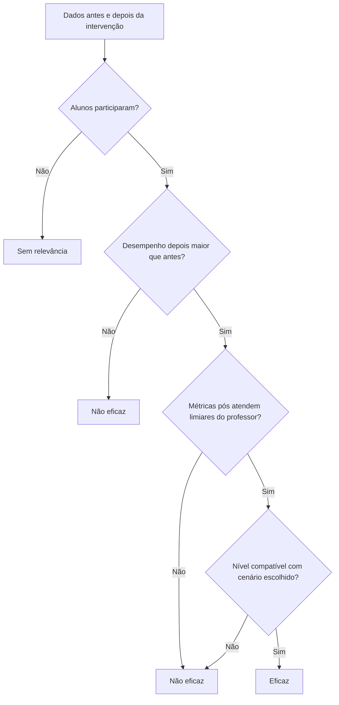

# Metodologia de avaliação de eficácia das intervenções pedagógicas

**Sistema:** Intervenções App (experimento de mestrado)  
**Versão do documento:** 1.0  
**Data:** maio/2026

---

# Parte I — Texto para a dissertação

## 1. Objetivo do modelo

Este modelo responde à pergunta central da pesquisa: **a intervenção pedagógica cadastrada pelo professor foi eficaz ou não?** A resposta não é intuitiva nem exclusivamente automática: ela combina (i) evidência de **aprendizagem** medida pelo desempenho antes e depois da intervenção; (ii) indicadores de **processo** (adesão, aderência, temporalidade); e (iii) **critérios de sucesso** definidos pelo próprio professor ao configurar o cenário e os limiares mínimos de cada métrica.

O desempenho ocupa posição **central e condicionante**: sem ganho de desempenho em relação ao pré-teste, a intervenção é classificada como **não eficaz**, independentemente de bons valores em aderência ou temporalidade. Essa escolha teórica alinha-se à ideia de que, em contexto pedagógico, eficácia deve indicar avanço na aprendizagem, não apenas participação ou cumprimento de tarefas.

## 2. Fundamentação conceitual

### 2.1 Desenho quasi-experimental pré-pós

Cada intervenção gera avaliações **PRÉ** (linha de base) e **PÓS** (após a ação pedagógica) por aluno. A comparação pré-pós permite inferir mudança no desempenho, em linha com avaliações de efetividade em contextos educacionais (nível de aprendizagem, adaptado de modelos de avaliação de programas como o de Kirkpatrick, nível 2 — aprendizagem).

**Limitação declarada:** no protótipo com dados sintéticos não há grupo controle; trata-se de desenho pré-experimental. A conclusão refere-se à **mudança observada** associada à intervenção no conjunto de dados da turma, não a causalidade estrita.

### 2.2 Avaliação critério-referenciada

O professor define, no cadastro do cenário, **limiares mínimos** (ou máximos, no caso do tempo) para:

- **Aderência** — percentual de execução das tarefas propostas entre os aderentes;
- **Temporalidade de início** — tempo até iniciar a atividade (quanto menor, melhor);
- **Temporalidade de fim** — tempo até concluir (quanto menor, melhor);
- **Desempenho** — resultado da aprendizagem no pós-teste.

Esses limiares funcionam como **critérios de referência**: o sistema verifica se o resultado agregado da turma **atinge ou não** o que o professor considerou aceitável para aquele cenário (Flexível, Moderado ou Difícil).

### 2.3 Cenários como perfis de exigência

Os cenários pré-definidos (Flexível, Moderado, Difícil) oferecem **valores padrão** de limiares, que o professor pode ajustar. A eficácia final exige que o **nível observado** nas métricas pós seja compatível com o cenário escolhido — por exemplo, cenário Moderado exige atingir pelo menos o perfil Moderado ou Difícil, não apenas o Flexível.

## 3. Modelo hierárquico de decisão (dois estágios)

### Estágio A — Condição de evidência (adesão)

Se **nenhum aluno aderir** à intervenção (adesão percentual igual a zero), não há base para avaliar eficácia. Classificação: **Sem relevância estatística**.

### Estágio B — Eixo principal: ganho em desempenho (aprendizagem)

Calcule-se o ganho médio de desempenho entre aderentes:

- Desempenho pré (média antes da intervenção)
- Desempenho pós (média depois, entre aderentes)
- **Ganho** = desempenho pós − desempenho pré

**Regra de veto:** se ganho ≤ 0, a intervenção é **Não eficaz** (sem ganho de aprendizagem), encerrando a análise neste eixo.

### Estágio C — Critérios do professor (limiares e cenário)

Somente se houver ganho em desempenho, o sistema verifica:

1. Se as médias pós de aderência, temporalidades e desempenho **atendem aos limiares** configurados na intervenção;
2. Se o **nível global atingido** (Flexível, Moderado ou Difícil, conforme tabela de classificação do sistema) é **compatível** com o cenário que o professor selecionou.

| Cenário configurado | Eficaz quando o nível observado for |
|---------------------|-------------------------------------|
| Flexível            | Flexível, Moderado ou Difícil       |
| Moderado            | Moderado ou Difícil                 |
| Difícil             | Apenas Difícil                      |

**Classificação final por intervenção:** Eficaz | Não eficaz | Sem relevância.

### Estágio D — Síntese na turma

Para a turma selecionada, o sistema agrega:

- Ganho médio de desempenho pré-pós (todas as intervenções com aderentes);
- Quantidade de intervenções classificadas como eficazes versus não eficazes.

A conclusão geral da turma considera **eficácia plena** quando há ganho médio de desempenho **e** todas as intervenções avaliáveis são eficazes segundo os critérios do professor.

## 4. Três camadas de interpretação (para discussão dos resultados)

| Camada | O que explica | Pergunta respondida |
|--------|---------------|---------------------|
| **1. Aprendizagem (desempenho)** | Comparação pré × pós | Os alunos aprenderam mais depois da intervenção? |
| **2. Processo pedagógico** | Adesão, aderência, tempos | Participaram e executaram a atividade como esperado? |
| **3. Meta do professor** | Cenário e limiares | O resultado atingiu o padrão que o professor definiu? |

A interpretação escrita no sistema segue essa ordem: primeiro aprendizagem, depois processo, depois meta — reforçando a prioridade do desempenho.

## 5. Índice sintético de eficácia (complementar)

O aplicativo pode exibir um **índice de 0 a 100** que resume múltiplas dimensões, com pesos aproximados:

- Cerca de **metade** do peso no ganho de desempenho;
- Parcelas menores para adesão, aderência, temporalidade e atingimento do limiar de desempenho pós.

**Regra:** se não houver ganho em desempenho, o índice é **zero**. O índice é instrumento de apoio à leitura; a classificação oficial permanece Eficaz / Não eficaz / Sem relevância.

## 6. Procedimento operacional no sistema

1. Professor cadastra intervenção e turma.
2. Professor define cenário e limiares (Etapa 2).
3. Sistema gera dados PRÉ e PÓS (experimento).
4. Na tela de Resultados, ao selecionar a turma, o sistema exibe:
   - Comparação de desempenho médio pré e pós;
   - Painel de eficácia geral do cenário;
   - **Interpretação da eficácia** (texto automático nas três camadas);
   - Detalhamento por intervenção e checklist de critérios.

## 7. Redação sugerida para o capítulo de método (parágrafo modelo)

> A eficácia das intervenções foi operacionalizada por um modelo hierárquico em três etapas. Primeiro, verificou-se se houve adesão dos alunos, condição necessária para análise. Em seguida, avaliou-se o ganho médio de desempenho entre o pré e o pós-teste: na ausência de ganho, a intervenção foi classificada como não eficaz para aprendizagem, independentemente dos demais indicadores. Por fim, quando houve ganho, compararam-se as médias pós de aderência, temporalidade e desempenho com os limiares definidos pelo professor no cenário configurado (Flexível, Moderado ou Difícil), verificando se o nível atingido correspondia à expectativa do perfil escolhido. O desempenho foi tratado como indicador principal, por representar o constructo de aprendizagem no experimento pedagógico.

## 8. Referências bibliográficas sugeridas

- Kirkpatrick, D. L., & Kirkpatrick, J. D. — avaliação em quatro níveis (aprendizagem).
- Scriven, M. — avaliação critério-referenciada.
- Campbell, D. T., & Stanley, J. C. — desenhos quasi-experimentais.
- Neto, P. (org.) — avaliação de programas e políticas educacionais (contexto brasileiro).

*(Ajuste autores, anos e páginas conforme ABNT da sua instituição.)*

---

# Parte II — Explicação simples (sem termos matemáticos)

## Para que serve este método?

Quando um professor registra uma intervenção no sistema, ele também escolhe um **cenário** (Flexível, Moderado ou Difícil) e pode ajustar **valores mínimos** de esforço e resultado — por exemplo: “quero pelo menos 60% de aderência e desempenho pós de pelo menos 60”.

Depois que os alunos passam pela intervenção, o sistema compara o **antes** e o **depois** e diz se aquela ação **funcionou para aprendizagem** ou não.

## O que é mais importante?

O indicador mais importante é o **desempenho**: a nota ou percentual que mostra quanto o aluno aprendeu.

- Se o desempenho **depois** não for **melhor** que o de **antes**, a intervenção é considerada **não eficaz**, mesmo que os alunos tenham participado bem ou terminado rápido.
- Isso porque o objetivo da pesquisa é saber se houve **ganho de aprendizagem**, não só engajamento.

## Como a decisão é tomada, passo a passo

**Passo 1 — Alguém participou?**  
Se ninguém aderiu à intervenção, não dá para avaliar. O sistema informa “sem relevância”.

**Passo 2 — Houve aprendizagem?**  
Compara o desempenho médio antes e depois. Se não melhorou (ou piorou), responde: **não eficaz**.

**Passo 3 — Atingiu o que o professor pediu?**  
Se melhorou o desempenho, o sistema olha as outras métricas (aderência, tempo para começar, tempo para terminar) e verifica se batem com os limites que o professor definiu no cenário.

**Passo 4 — Conclusão**  
- **Eficaz:** participação + aprendizagem melhorou + bateu com o cenário do professor.  
- **Não eficaz:** não melhorou o desempenho, ou melhorou mas ficou abaixo do que o professor exigia.  
- **Sem relevância:** sem participação para analisar.

## As três explicações que o sistema mostra na tela

1. **Aprendizagem** — Conta se os alunos foram melhor depois (desempenho).  
2. **Processo** — Conta se participaram, fizeram as tarefas e em quanto tempo.  
3. **Meta do professor** — Conta se o resultado ficou dentro do cenário que ele escolheu (fácil, médio ou difícil).

No final aparece um **texto em linguagem clara** resumindo tudo isso para a turma e para cada intervenção.

## O que é o “índice” na tela?

É um número de 0 a 100 que resume o conjunto, dando **mais peso ao desempenho**. Serve como leitura rápida, mas a palavra final continua sendo: eficaz, não eficaz ou sem relevância.

Se não houve ganho de desempenho, o índice fica em zero.

## Por que o professor define os limiares?

Porque cada contexto de sala de aula é diferente. O mesmo número pode ser exigente para uma turma e leve para outra. A pesquisa investiga se o **professor consegue declarar suas expectativas** e se o sistema **interpreta os dados** de acordo com essas expectativas — com o desempenho como eixo principal de aprendizagem.

## Frase simples para apresentar na banca

> “Consideramos eficaz a intervenção quando os alunos aprendem mais depois do que antes — isso aparece no desempenho — e quando esse resultado também cumpre o padrão de exigência que o próprio professor definiu ao configurar o cenário.”

---

# Anexo — Fluxo do modelo (diagrama)

---

*Documento gerado para o projeto Intervenções App. Download na aplicação: menu Resultados → link “Baixar metodologia (dissertação)” ou rota `/docs/metodologia-eficacia` (usuário autenticado).*
